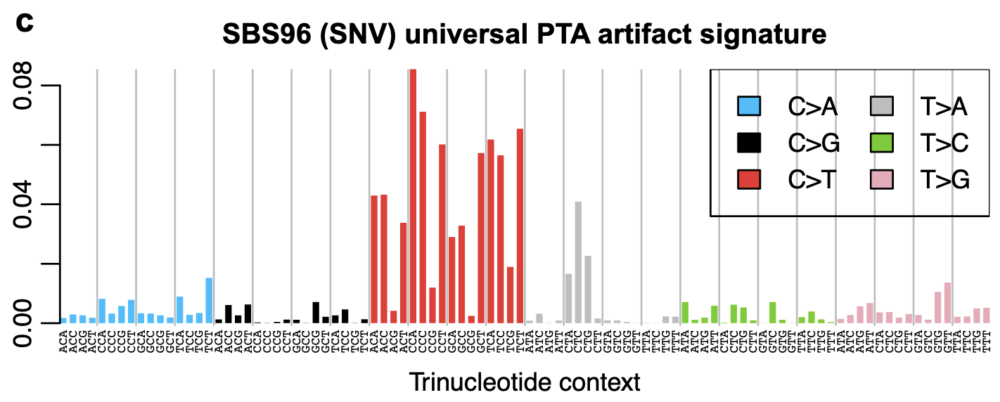

```{r setup, include = FALSE}
knitr::opts_knit$set(root.dir = "../..")
knitr::opts_chunk$set(
  warning = FALSE,
  message = FALSE,
  dpi = 300,
  cache.path = params$cache_path,
  fig.align = "center"
)
```

```{r setup2, include = FALSE}
# libraries
library(magrittr)
library(dplyr)
library(ggplot2)
library(BSgenome.Hsapiens.UCSC.hg38)

# set ggplot presets
theme_set(theme_classic())

# set palette
pal <- c(true = "#91C7B1", artefact = "#B33951", breakpoint = "#E3D081")
```

In the PTA dataset, we have 23 independent chr1p CN-LOH events. The cells are 
also all from a male, so cells have one X chromosome. In these two contexts, we
can look for PTA artefacts, as any variants called at a significantly lower VAF
than 1 are likely to be amplified artefacts, as all true variants should be at 
a VAF of 1.

As described in Lovelace Luquette's thesis:

> Hemizygous male X chromosomes have been previously exploited in single cell
> studies for estimating FDR (Lodato et al. 2015), utilizing the fact all true 
> mutations on the hemizygous chromosome should have VAF close to 100%.

First, we load the breakpoints and the variant calls. We filter to those on chrX
and those on chr1p in cells affected by CN-LOH (beyond the breakpoint).

```{r load-breakpoints}
# load breakpoints
breakpoints <-
  readr::read_tsv("out/phase_snps/phase_snps_cache/breakpoints_and_haps.tsv") %>%
  dplyr::mutate(chr = "chr1")

# encode pseudoautosomal positions on x
par_x <- c(60001:2699520, 154931044:155260560)

# get mutations from the tree on chr1p / non-PAR x
muts <-
  c("NV", "NR") %>%
  purrr::set_names() %>%
  purrr::map(function(i) {
    paste0("out/resolveome/sequoia/20250918/Patient_both_", i, "_tree_all.txt") %>%
      read.table() %>%
      tibble::as_tibble(rownames = "mut_id") %>%
      dplyr::filter(grepl("chr1_|chrX_", mut_id)) %>%
      tidyr::separate_wider_delim(cols = mut_id, delim = "_",
                                  names = c("chr", "pos", "ref", "alt")) %>%
      tidyr::pivot_longer(cols = -c(chr, pos, ref, alt), names_to = "id")
  }) %>%
  dplyr::bind_rows(.id = "name") %>%
  tidyr::pivot_wider() %>%
  dplyr::rename(alt_depth = NV, total_depth = NR) %>%
  dplyr::mutate(pos = as.numeric(pos)) %>%
  # add breakpoints
  dplyr::left_join(breakpoints) %>%
  # filter to chr1p variants (pos < breakpoint) and chrX non-PAR variants
  dplyr::filter((chr == "chr1" & !is.na(breakpoint) & pos < breakpoint) | 
                chr == "chrX" & !(pos %in% par_x)) %>%
  # filter on depth
  dplyr::filter(alt_depth > 0, total_depth >= 5) %>%
  dplyr::mutate(alt_vaf = alt_depth / total_depth)
```

We plot the VAF distribution for chr1p and chrX variants.

```{r plot-vaf}
p_dat <- split(muts, muts$chr)
purrr::walk2(names(p_dat), p_dat, function(.x, .y) {
  p <- alexr::plot_vaf_dist(.y) + ggtitle(.x)
  print(p)
})
```

There do appear to be a number of variants at lower VAFs here.

```{r plot-low-vaf}
purrr::walk2(names(p_dat), p_dat, function(.x, .y) {
  p <-
    .y %>%
    dplyr::filter(alt_vaf < 0.9) %>%
    alexr::plot_vaf_dist() +
    ggtitle(.x)
  print(p)
})
```

We classify variants with VAF < 0.75 as artefactual, and those with VAF >= 0.9
as true variants. We filter to those with a total depth > 5 to avoid low-depth
noise.

```{r estimate-fdr, fig.width = 12}
# get true and artefactual mutations
classed_muts <-
  muts %>%
  dplyr::mutate(class = dplyr::case_when(
    alt_vaf < 0.75 ~ "artefact",
    alt_vaf >= 0.9 ~ "true",
    TRUE ~ NA
  )) %>%
  dplyr::filter(!is.na(class), total_depth > 5)

# plot counts of true / artefactual mutations per cell
p_dat <-
  classed_muts %>%
  dplyr::add_count(id, chr, name = "n_total") %>%
  dplyr::count(id, chr, class, n_total) %>%
  dplyr::mutate(chr1p_LOH = ifelse(id %in% breakpoints$id, "chr1p LOH", "chr1p diploid"))
p_dat <-
  p_dat %>%
  dplyr::left_join(
    p_dat %>%
      dplyr::filter(chr == "chrX") %>%
      dplyr::transmute(id, n_total_x = n_total) %>%
      dplyr::distinct())
p_dat %>%
  ggplot(aes(x = reorder(id, -n_total_x), y = n, fill = class)) +
  geom_col() +
  facet_grid(chr ~ chr1p_LOH, scales = "free", space = "free") +
  scale_x_discrete(guide = guide_axis(angle = -90)) +
  theme(axis.title.x = element_blank()) +
  scale_fill_manual(values = pal) +
  scale_y_continuous(expand = c(0, 0))
```

We look at how the load of artefacts on chr1 varies with breakpoint length.

```{r estimate-fdr-chr1}
# scale FDR in chr1 to breakpoint length
p_dat_2 <-
  p_dat %>%
  dplyr::filter(chr == "chr1") %>%
  dplyr::left_join(breakpoints) %>%
  dplyr::mutate(n_per_mb = n / breakpoint / 1e6) %>%
  dplyr::group_by(id) %>%
  dplyr::mutate(n_per_mb_total = sum(n_per_mb)) %>%
  dplyr::ungroup() %>%
  dplyr::mutate(id = forcats::fct_reorder(id, -breakpoint)) %>%
  tidyr::pivot_longer(cols = c("n", "n_per_mb")) 
p_dat_2 <-
  p_dat_2 %>%
  dplyr::bind_rows(
    p_dat_2 %>%
      dplyr::transmute(id, name = "breakpoint", class = "breakpoint", value = breakpoint) %>%
      dplyr::distinct()
  ) %>%
  dplyr::mutate(class = factor(class, levels = c("true", "artefact", "breakpoint")))
p_dat_2 %>%
  ggplot(aes(x = id, y = value, fill = class)) +
  geom_col() +
  facet_grid(name ~ ., scales = "free_y") +
  scale_x_discrete(guide = guide_axis(angle = -90)) +
  theme(axis.title.x = element_blank()) +
  scale_fill_manual(values = pal) +
  scale_y_continuous(expand = c(0, 0))
```

We plot VAF vs distance from called chr1p breakpoint to check whether these
artefacts are not due to a miscalled breakpoint.

```{r vaf-vs-breakpoint}
classed_muts %>%
  dplyr::filter(chr == "chr1") %>%
  dplyr::mutate(dist_from_breakpoint = breakpoint - pos) %>%
  ggplot(aes(x = dist_from_breakpoint, y = alt_vaf, colour = class)) +
  geom_point() +
  scale_colour_manual(values = pal)
```

We plot the trinucleotide spectra of these true and false variants.

```{r plot-trinucs, fig.width = 10, fig.height = 5}
# get artefactual trinucs
artefact_trinucs <-
  classed_muts %>%
  dplyr::filter(class == "artefact", nchar(ref) == 1, nchar(alt) == 1) %>%
  as.data.frame() %>%
  deconstructSigs::mut.to.sigs.input(
    sample.id = "id", bsg = BSgenome.Hsapiens.UCSC.hg38)

# get true trinucs
true_trinucs <-
  classed_muts %>%
  dplyr::filter(class == "true", nchar(ref) == 1, nchar(alt) == 1) %>%
  as.data.frame() %>%
  deconstructSigs::mut.to.sigs.input(
    sample.id = "id", bsg = BSgenome.Hsapiens.UCSC.hg38)

# function: plot trinucs
plot_trinucs <-
  function(p_dat) {
    sub_colours <-
      c("C>A" = "dodgerblue", "C>G" = "black", "C>T" = "red",
        "T>A" = "grey70", "T>C" = "olivedrab3", "T>G" = "plum2")
    p_dat %>%
      tibble::enframe(name = "sub", value = "count") %>%
      dplyr::mutate(trinuc_sub = substr(sub, 3, 5),
                    trinuc = paste0(substr(sub, 1, 1), substr(sub, 3, 3), substr(sub, 7, 7))) %>%
      ggplot(aes(x = trinuc, y = count, fill = trinuc_sub)) +
      geom_col() +
      facet_grid(~ trinuc_sub, scales = "free_x", space = "free_x") +
      scale_fill_manual(values = sub_colours) +
      theme_minimal() +
      theme(axis.text.x = element_text(family = "mono"),
            legend.position = "none") +
      scale_x_discrete(guide = guide_axis(angle = -90))
  }

# plot trinucs
plot_trinucs(colSums(artefact_trinucs)) + ggtitle("Artefactual variants (VAF < 0.75)")
plot_trinucs(colSums(true_trinucs)) + ggtitle("True variants (VAF >= 0.9)")
```

For comparison, here is the "universal PTA artefact signature" identified by
Luquette et al., 2022:


